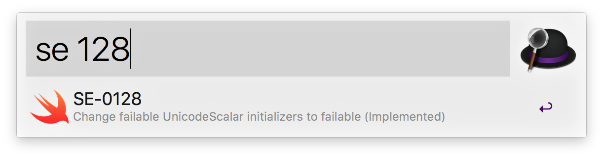
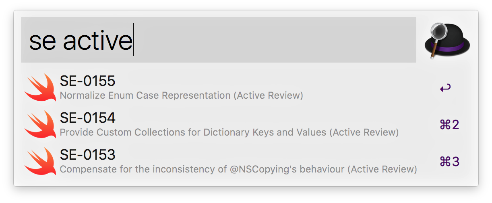
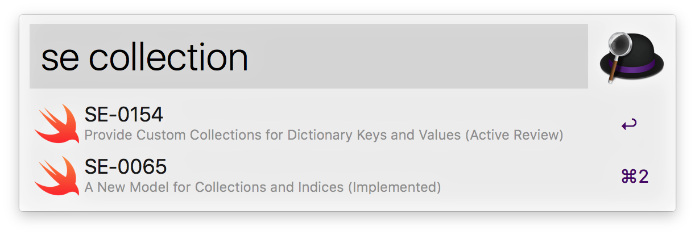

# alfred-swift-evolution

An [Alfred] workflow for looking up Swift evolution proposals.
Written in Swift, of course.

[Alfred]: https://www.alfredapp.com

## Requirements

You must have Swift 5 or newer installed (either by a version of Xcode or
Command Line Tools).

## Download

Download version 2.2.0 of [alfred-swift-evolution.alfredworkflow][download].

[download]: https://github.com/attaswift/alfred-swift-evolution/releases/download/v2.2.0/alfred-swift-evolution.alfredworkflow

## Usage

Type <kbd>se</kbd> followed by a space to list all proposals (more
recent first). Optionally type a search string to filter results.

You can filter by proposal number:

Or by proposal status:

Or by keyword:

Available actions:

* Press Return to open the proposal in the browser.
* Hold down Command to copy the proposal title to the clipboard.
* Hold down Shift+Command to copy a Markdown link to the proposal to the clipboard.
* (To copy the URL, hit Tab on a proposal and select Copy as Plain Text from the menu.)

### Workflow variables

The script forwards four variables to Alfred that can be used in subsequent workflow actions:

* `proposal_id` (e.g. "SE-0304")
* `proposal_title` ("Structured concurrency")
* `proposal_status` ("Implemented")
* `proposal_url` ("https://github.com/apple/swift-evolution/blob/main/proposals/0304-structured-concurrency.md")

If you want to customize the workflow for your needs, you can use these variables in your actions. Refer to the "Copy Markdown link" action for an example.
